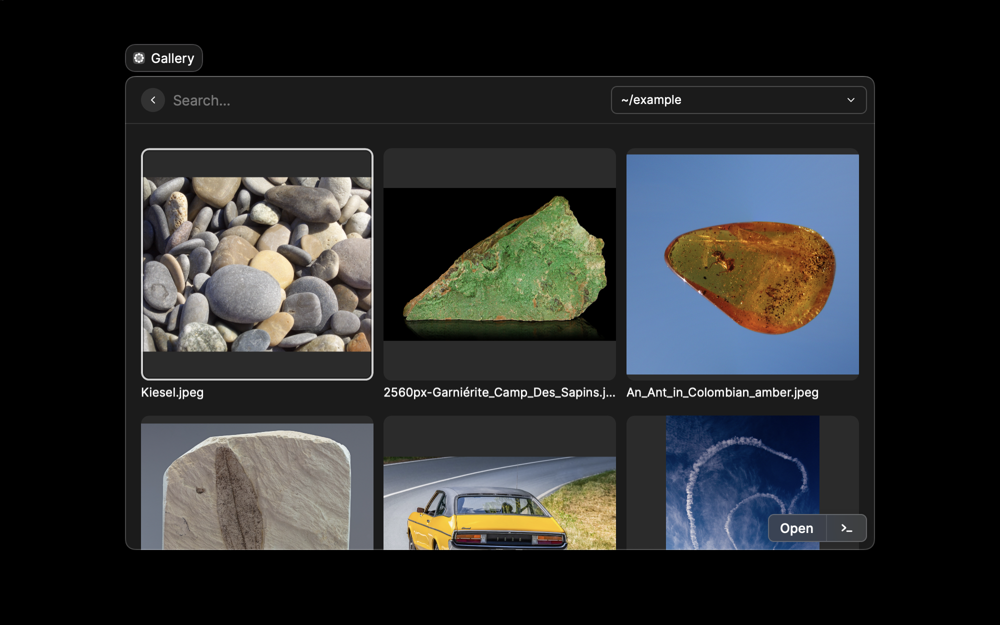

  

#### Gallery
---

Display and search images from a selection of folders.

  

#### TODO
---

- [x] Add a checkbox preference for displaying video files
- [x] Make a better icon for video files
- [x] Move Grid itemSize into preferences
- [x] Use the Grid Dropdown to swap between "Everything" and each of the input folders
- [x] Figure out a way to index filenames for raycast search w/o having to display the item title
- [x] Add a checkbox preference for showing filenames
- [ ] Make a nicer empty screen
- [ ] Add functions under `cmd+K` to rename or delete the selected file
- [ ] Add a preference to order the files by e.g. Most recent, A-Z, or Random